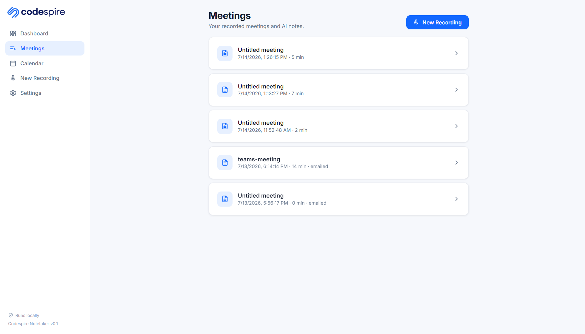
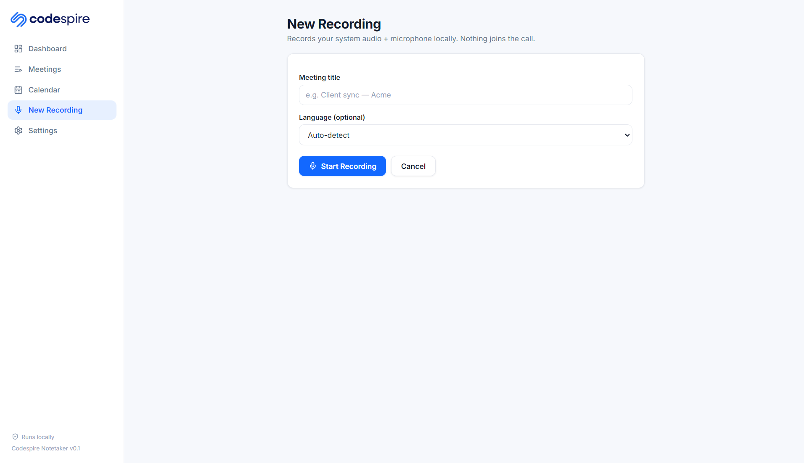
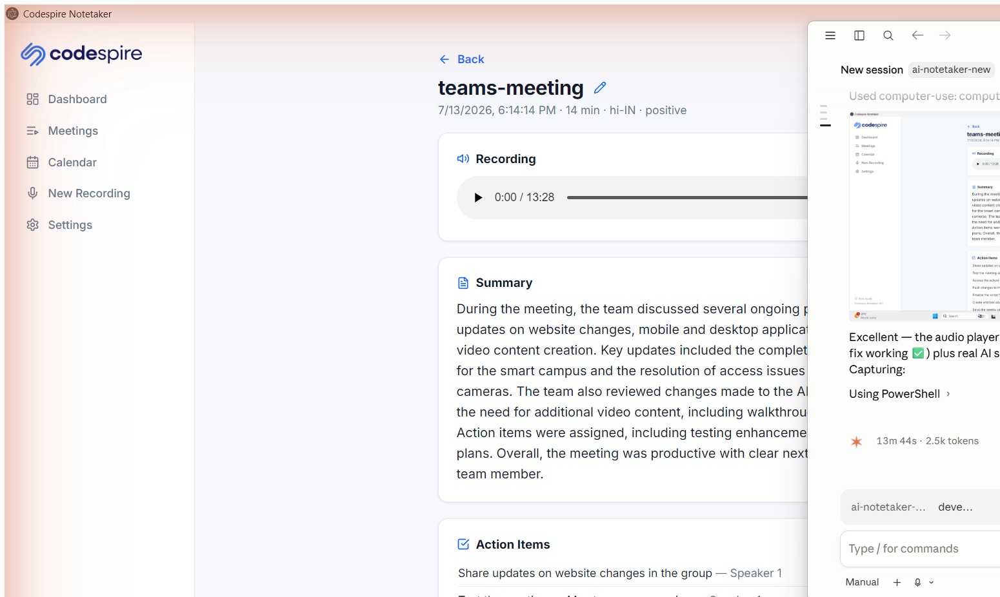
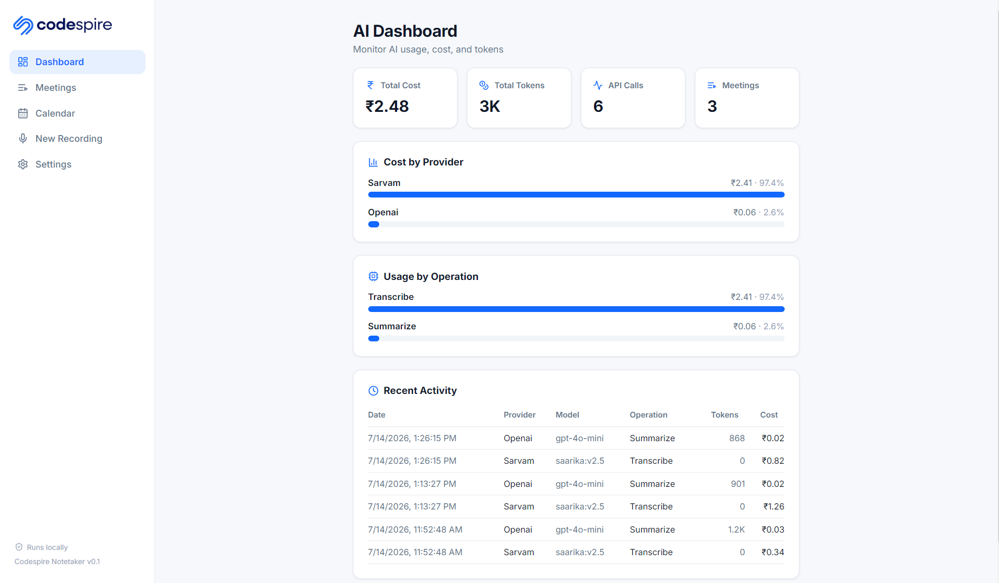
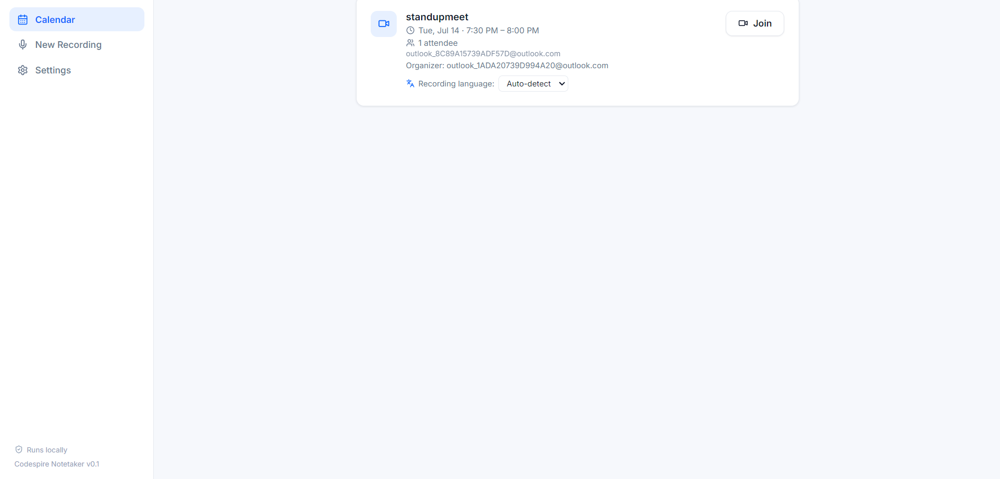
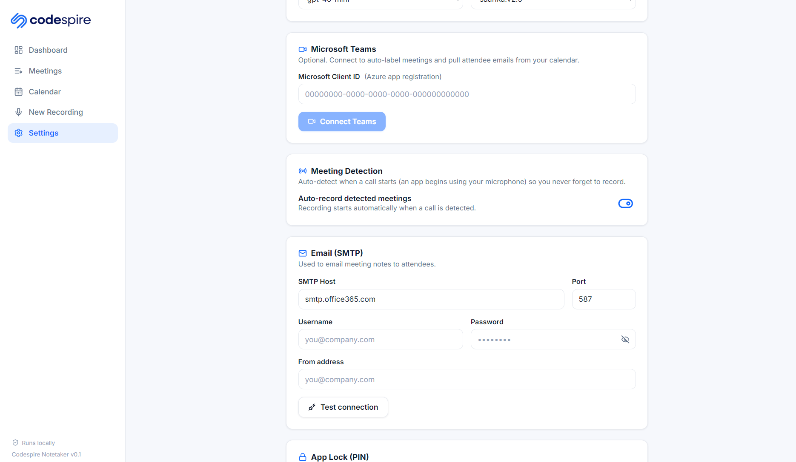

<div align="center">


# Codespire Notetaker

**Record, transcribe and summarize your meetings — entirely on your own PC.**

<br />

[](https://github.com/Codespire-Sol/ai-notetaker-desktop/releases/latest)
[](https://github.com/Codespire-Sol/ai-notetaker-desktop/releases)
[](LICENSE)
[](https://github.com/Codespire-Sol/ai-notetaker-desktop/releases/latest)
[](https://github.com/Codespire-Sol/ai-notetaker-desktop/releases/latest)
[](https://www.electronjs.org/)

</div>

---

**No bot joins your call.** Nothing shows up in the participant list, no browser automation, no meeting link to paste. Codespire Notetaker records the audio your computer is already playing — plus your microphone — straight from your own machine, and turns it into a transcript, a summary and a list of action items.

Works with **any** meeting app: Teams, Zoom, Google Meet, Webex, a phone call on speaker, or an in-person conversation.

---

## ⬇ Download

Grab the installer for your computer, then open it. Everything runs on your own PC.

| Your computer | Download | After you download |
|---------------|----------|--------------------|
| **Windows** (.exe) | [Download for Windows →](https://github.com/Codespire-Sol/ai-notetaker-desktop/releases/latest) | Double-click the **Setup** file and follow the prompts. Allow microphone access when Windows asks. |
| **macOS** (.dmg) | [Download for Mac →](https://github.com/Codespire-Sol/ai-notetaker-desktop/releases/latest) | Open the **.dmg**, drag the app to **Applications**, then **right-click → Open** the first time. Grant **Microphone** and **Screen & System Audio Recording** in System Settings → Privacy & Security. |

> Installers are published automatically on each release. If you don't see a build yet, check the [Releases page](https://github.com/Codespire-Sol/ai-notetaker-desktop/releases).

After installing, open **Settings** and paste your OpenAI + Sarvam API keys — see [Quick start](#-quick-start).

---

## 📸 Screenshots

|  |  |
|:---:|:---:|
| <br/>**Meetings** — every recording, searchable, with its notes | <br/>**Recording** — system audio + mic, live timer and level meter |
| <br/>**Meeting detail** — summary, action items, decisions + audio player | <br/>**AI Dashboard** — token usage and ₹ cost per provider and operation |
| <br/>**Calendar** — upcoming Teams / Outlook meetings, with a recording language per meeting | <br/>**Settings** — your own API keys, SMTP, Teams and meeting auto-detection |

---

## ✨ Features

**🎙 Recording**
- Captures **system audio + microphone**, mixed into a single track — you hear both sides of the call
- **No bot, no browser automation** — nothing appears in the meeting for other participants
- **Auto-detects meetings**: when another app starts using your microphone, a call has begun → Notetaker either starts recording automatically or shows a *"Meeting detected"* prompt
- **Stops automatically** when the call ends — so early, late and completely ad-hoc meetings are still captured
- Recordings are saved as MP3 on your machine

**📝 Transcription — Sarvam AI**
- Auto-detects the spoken language
- **English, Hindi, Telugu, Tamil, Marathi, Bengali, Gujarati**
- Optional per-meeting language override from the Calendar

**🧠 AI notes — OpenAI**
- Concise **summary**
- **Action items** with task, owner and due date
- **Key decisions**
- **Follow-up questions**
- Overall **sentiment**

**📧 Email**
- Sends the notes to attendees through **your own SMTP** server
- Transcript attached as a `.txt`
- Audio MP3 attached when it's under 20 MB

**📅 Microsoft Teams / Outlook calendar** *(optional)*
- Connect with OAuth to see your upcoming meetings
- Recordings are auto-labelled with the **meeting title** and **attendee emails** — so the notes email is pre-addressed
- Set a **recording language per meeting**

**📊 AI Dashboard**
- Usage and cost tracking per provider, per operation — calls, tokens and **₹ cost**

**🔐 Everything else**
- **PIN lock** on the app
- Premium light UI in Codespire blue `#1268ff`
- Keys entered in the in-app **Settings** screen (or a `.env` for development)

---

## 🔄 How it works

```
   📞  Call starts
       (an app grabs your microphone — Teams, Zoom, Meet, anything)
        │
        ▼
   🎙  RECORD  ── system audio  ┐
       (local)                 ├──►  single mixed MP3, saved on your PC
                  microphone  ─┘
        │
        │  call ends → recording stops automatically
        ▼
   📝  TRANSCRIBE  ──►  Sarvam AI
       auto-detects language (EN / HI / TE / TA / MR / BN / GU)
        │
        ▼
   🧠  SUMMARIZE   ──►  OpenAI
       summary · action items · decisions · follow-ups · sentiment
        │
        ▼
   📧  EMAIL NOTES  ──►  your SMTP  ──►  attendees
       + transcript (.txt)   + audio (.mp3, if < 20 MB)
```

Only steps 3, 4 and 5 leave your machine — and they go to *your* Sarvam, OpenAI and SMTP accounts. Never to Codespire.

---

## 🚀 Quick start

1. **Install** the app for your OS (see [Download](#-download)) and open it.
2. **Set a PIN** when prompted — it locks the app on your machine.
3. **Open Settings** and paste your keys:
   - **OpenAI API key** — for summaries and action items ([platform.openai.com](https://platform.openai.com/api-keys))
   - **Sarvam API key** — for transcription ([dashboard.sarvam.ai](https://dashboard.sarvam.ai/))
   - **SMTP** — host, port, username, password and the *from* address used to email notes (e.g. `smtp.office365.com` on port `587`)
4. *(Optional)* **Connect Microsoft Teams / Outlook** to pull in your calendar and attendee lists. You'll need an Azure app registration — follow **[docs/AZURE-SETUP.md](docs/AZURE-SETUP.md)**.
5. **Record.** Hit **Record**, or just start your meeting and let auto-detect do it.

---

## 🛠 Build from source

Requires **Node.js 20+**.

```bash
git clone https://github.com/Codespire-Sol/ai-notetaker-desktop.git
cd ai-notetaker-desktop

npm install        # install dependencies
npm run dev        # run the app in development (hot reload)

npm run build      # compile main + preload + renderer
npm run package:win   # build the Windows installer (.exe)
npm run package:mac   # build the macOS disk image (.dmg)
```

Installers are written to `release/`.

For development you can put your keys in a `.env` (copy `.env.example`) instead of typing them into Settings each time. In a packaged build, Settings is the only place keys are read from.

---

## 🔐 Privacy

**Everything runs on your machine.**

- Audio is captured, mixed and stored **locally** — recordings never touch a Codespire server.
- Transcripts, AI notes and settings live in a local **electron-store** file and local audio files on your disk.
- Your **API keys, SMTP password and Microsoft token stay on your PC**. They are never transmitted to Codespire.
- The **only** network calls the app makes are: transcription to **Sarvam**, summarization to **OpenAI**, the calendar read from **Microsoft Graph** (only if you connect it), and the notes email through **your own SMTP server**. All of them use *your* accounts.
- **No bot joins your meeting.** Other participants see nothing — check your local recording laws and tell people they're being recorded.
- Delete a meeting in the app and its audio and transcript are removed from disk.

---

## 📚 Documentation

| Guide | What it covers |
|-------|----------------|
| [User guide](docs/USER-GUIDE.md) | Day-to-day use — recording, notes, emailing attendees |
| [Install on Windows](docs/INSTALL-WINDOWS.md) | Setting up on a Windows PC |
| [Install on Mac](docs/INSTALL-MAC.md) | Setting up on a Mac, including audio permissions |
| [Configuration](docs/CONFIGURATION.md) | API keys, SMTP, languages, auto-detect settings |
| [Azure setup](docs/AZURE-SETUP.md) | Connecting Microsoft Teams / Outlook calendar |

---

## 🛟 Support

- **Email:** [admin@codespiresolutions.com](mailto:admin@codespiresolutions.com)
- **Report an issue:** [GitHub Issues](https://github.com/Codespire-Sol/ai-notetaker-desktop/issues)
- **Security:** please report privately — see [SECURITY.md](SECURITY.md)

---

## ⚖️ License

Licensed under the **Elastic License 2.0** — *source-available*. You may use, modify and self-host the software (including to run your own business), but you may **not** offer it to others as a hosted or managed service. See [LICENSE](LICENSE) for the full terms.

Copyright (c) 2026 Codespire Solutions. All rights reserved.
